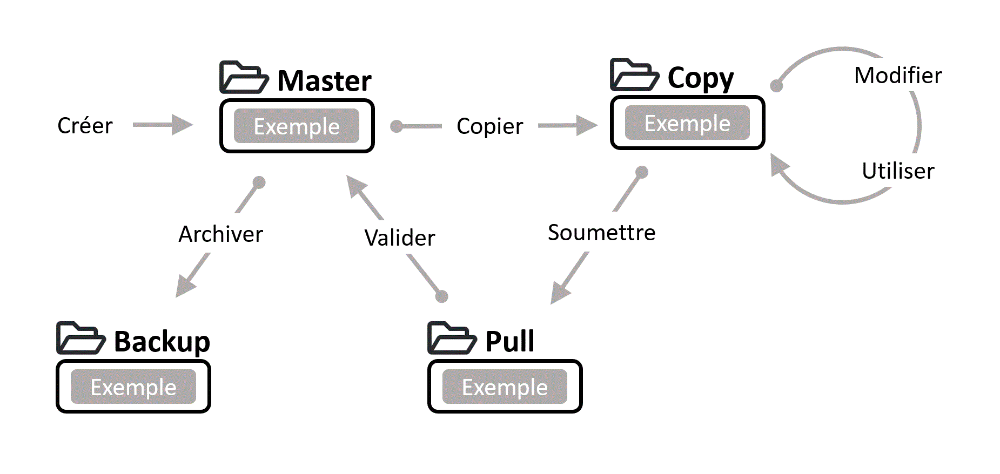

# SoftGestion
Interface facilitant la manipulation de répertoires ayant du contenu évolutif.

## Installation
### Environnements d’exécution
**Serveur:**
[NodeJS](https://nodejs.org/en/)  et  NPM doit être disponibles depuis l'invite de commande.
[PM2](https://pm2.io/runtime/) sera utilisé pour gérer l’exécution.

**Client:** 
    L'application fonctionne sur n'importe quel navigateur moderne.
    Cependant, l'interface propose des liens permettent d'accéder directement aux répertoires Windows. Ce qui n'est nativement pas possible pour le navigateur. Pour résoudre le problème, il faut installer l'extension  [Local Explorer](https://chrome.google.com/webstore/detail/local-explorer-file-manag/eokekhgpaakbkfkmjjcbffibkencdfkl) pour Google Chrome. Une autre solution, si vous souhaitez utiliser un autre navigateur, est de changer les paramètres de sécurité pour l'adresse en question.

### Installation et démarrage

    # Téléchargement
    $ npx degit PeufOne/softgestion softgestion
    
    # Se rendre dans le sous-répertoire
    $ cd softgestion

    # Installation des modules
    $ npm i
    
    # Démarrage du serveur de production
    $ npm run prod
    
    # Monitoring
    $ pm2 monit
    
    # Plus de manipulation disponible dans la doc de pm2...
    
   
### Configuration du serveur
Le port  de production configuré par défaut est le  ***3000*** mais il peut être changé dans le fichier ***config.js***.

    module.exports = {
        PORT: dev ? 3001 : 3000
    }

### Configuration du client
Tant que les chemins de vos répertoires ne seront pas configurés, vous serez automatiquement redirigé sur la page d’administration...

1. Cliquez sur l'onglet *Gestion des chemins*
2. Renseignez les quatre champs (Attention, les chemins que vous indiquez doivent exister sur votre réseau et être accessible par le serveur)
3. Cliquez sur *Sauvegarder*
4. Vous pouvez désormais vous rendre sur la page d’accueil

NOTE: Pour que le serveur puisse envoyer un visuel des PDF contenu dans vos dossiers, il est nécessaire de redémarrer le serveur après avoir défini vos chemins.

L'application est maintenant entièrement disponible.

## Utilisation
Importez vos dossiers:

1. Cliquez sur le clickboard

...

La suite devrait être assez instinctif pour ce passer de tutoriel...

TODO: Décrire les fonctionnalités

## Notes

Cette application n'est qu'un prototype (version 0.1.0) et de nombreuses corrections et améliorations devront encore être apporté...

Le but principal du projet est l'apprentissage et l'expérimentation de technologies modernes du web.
N’hésitez donc pas à être force de proposition concernant l'ergonomie de l'interface ou la qualité du code.

Enjoy \\( ﾟ▽ﾟ)/